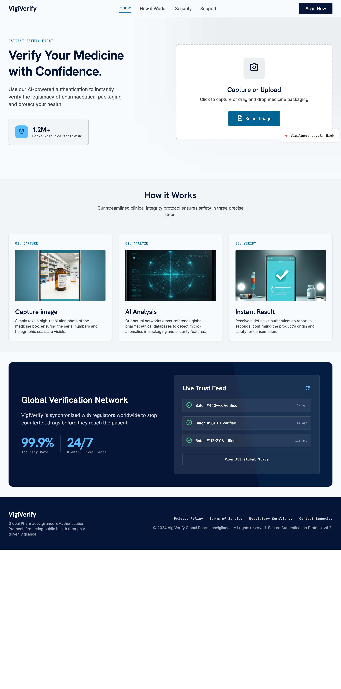

# PharmaCheck API

A FastAPI-based machine learning system for counterfeit medicine packaging detection using a lightweight CNN (MobileNetV3) exported to TensorFlow Lite (INT8) for fast inference.

> Scope: This system performs packaging-level verification only. It does not analyze chemical composition.

---

## Features

- CNN-based classification (Authentic vs Counterfeit)
- Fast inference using TensorFlow Lite (optimized for edge and server)
- Camera-ready base64 image API
- Batch image prediction (up to 20 images)
- Scan history tracking (JSONL storage)
- Analytics (statistics, confidence distribution, heatmaps)
- Export results as CSV and JSON
- Fully Dockerized deployment
- REST API ready for Android integration

---

## Tech Stack

- FastAPI
- TensorFlow Lite (TFLite INT8 model)
- NumPy
- Pillow
- Matplotlib
- Docker

---

## Project Structure

